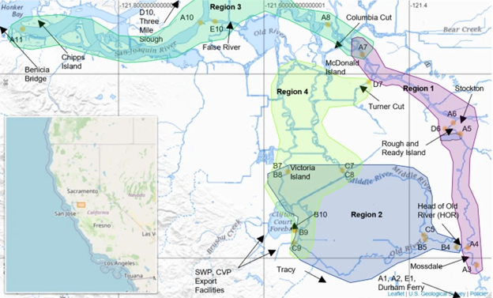

```{r setup, include = FALSE}
knitr::opts_chunk$set(message = FALSE, warning = FALSE, echo = FALSE)
```

# Steelhead Elicitation Results Round 2

These are the results of Steelhead STARS Elicitation Round 2.

We have displayed covariate results, and shared all rationale responses. Bolded responses are those that have changed. Rationales are accompanied by summaries by region and metric. While we've provided an executive summary for convenience, we highly recommend reading the detailed rationales and resources that the participants provided. The summaries, by nature, can't fully capture the nuances and caveats provided by the participants.

```{r, echo = FALSE}
library(readr)
library(dplyr)
library(here)
library(ggplot2)
library(tidyr)
library(stringr)
library(viridis)
library(kableExtra)
```

```{r, echo = FALSE}
res2 = read_csv(here("docs/elicitation_round2.csv"), skip = 1,
                col_names = c("Name", 
                              "cov_surv_1", "rat_surv_1", "conf_surv_1",
                              "cov_surv_2", "rat_surv_2", "conf_surv_2",
                              "cov_surv_3", "rat_surv_3", "conf_surv_3",
                              "cov_surv_4", "rat_surv_4", "conf_surv_4",
                              "cov_rout_1", "rat_rout_1", "conf_rout_1",
                              "cov_rout_2", "rat_rout_2", "conf_rout_2",
                              "cov_rout_3", "rat_rout_3", "conf_rout_3",
                              "cov_rout_4", "rat_rout_4", "conf_rout_4",
                              "cov_time_1", "rat_time_1", "conf_time_1",
                              "cov_time_2", "rat_time_2", "conf_time_2",
                              "cov_time_3", "rat_time_3", "conf_time_3",
                              "cov_time_4", "rat_time_4", "conf_time_4",
                              "comments1", "comments2"
                                                                      ))
# rename confidence
results2 <- res2 %>%
  mutate(across(starts_with("cov"), ~as.factor(.))) %>%
  mutate(
    across(
      starts_with("conf"), 
      ~case_when(
        str_detect(., regex("Medium")) ~ "Medium",
        str_detect(., regex("Low")) ~ "Low",
        str_detect(., regex("High")) ~ "High",
        TRUE~.)
      )
    )

# just the comments for processing
comments <- results2 %>%
  select(Name, comments1, comments2)

# make results in a way easy to plot
results_r2 <- results2 %>%
  pivot_longer(
    cols = starts_with("conf") | starts_with("cov") | starts_with("rat"),
    names_to = "original_col_name",
    values_to = "temp_value"
  ) %>%
  separate(
    original_col_name,
    into = c("question", "metric", "region")) %>%
  pivot_wider(
    names_from = question,
    values_from = temp_value,
    id_cols = c(Name, metric, region)
  ) %>%
  rename(covariate = cov) %>%
  # standardize "null" versions
  mutate(covariate = if_else(str_detect(covariate, regex("null", ignore_case = TRUE)), "Null", covariate)) %>%
  mutate(covariate = replace(covariate, is.na(covariate), "Null"))

results_pc_r2 <- results_r2 %>%
  mutate(conf_val = case_when(conf== "Low" ~ 1L,
                              conf == "Medium" ~ 2L, 
                              conf == "High" ~ 3L,
                              TRUE~0L))%>%
  group_by(metric, region, covariate) %>%
  summarize(resp = n(),
            med_conf = median(conf_val)) %>%
  ungroup() %>%
  complete(region, 
           nesting(covariate, metric),
           fill = list(resp = 0)) %>%
  mutate(total = 16,
         prop = round(resp/total,2)) %>%
  filter(!(is.na(covariate) & resp ==0)) %>%
  mutate(metric = case_when(metric == "surv"~"Survival",
                            metric == "rout"~"Routing",
                            metric == "time"~"TravelTime",
                            TRUE~metric),
         metric = factor(metric, levels = c("Survival", "Routing","TravelTime"))) 

results_pc_r2_conf <- results_r2 %>%
  filter(conf != "Low") %>%
  group_by(metric, region) %>%
  mutate(total = n()) %>%
  ungroup() %>%
  group_by(metric, region, covariate, total) %>%
  summarize(resp = n()) %>%
  ungroup() %>%
  complete(region, 
           nesting(covariate, metric),
           fill = list(resp = 0)) %>%
  mutate(prop = round(resp/total,2),
         prop = replace(prop, is.na(prop), 0)) %>%
  filter(!(is.na(covariate) & resp ==0)) 
```


## Region Designations



## Region 1 (Upper San Joaquin River) Covariates

### Covariate Selection

```{r }
ggplot(results_pc_r2 %>% filter(region == 1)) + 
  geom_col(aes(metric, resp, fill = covariate), color = "black") +
  scale_fill_viridis(discrete = T, option = "plasma", direction = -1) +
  labs(y = "Number of Responses")+
  theme_bw()+
  theme(axis.text = element_text(size = 14), axis.title = element_text(size = 14), legend.text = element_text(size = 14), legend.title = element_text(size = 14))
```
```{r}
kable(results_pc_r2 %>% filter(region == 1) %>% select(metric, covariate, prop, med_conf) %>%arrange(metric),
      format = "html",
      align = "c",
      label = NA,
      vline = "",
      caption = "Covariates and Confidence for Region 1 by Metric. Prop refers to the proportion of people who selected each covariate and Med_conf is the median confidence for each selection.",
      valign = "t") %>%
  kable_styling(full_width = F) %>%
  row_spec(row = 0, bold = TRUE) %>%
  row_spec(c(4,8, 12),extra_css = "border-bottom: 1px solid;")
```

### Explanations

Near-unanimous consensus among experts that Vernalis flow is the primary driver for all three metrics (survival, routing, and travel time).

#### Summary

---

#### Rationales 

##### Survival

General agreement that higher Vernalis flow is directly correlated with higher survival rates. This was attributed to a combination of factors, including improved water quality (e.g., lower temperatures), reduced predation risk due to faster transit, and the minimal hydrodynamic influence of south Delta exports in this region. 

###### Vernalis Flow

- SJR flow strongly influences hydrodynamic conditions experienced by juvenile steelhead in most of this region. In contrast, export effects on hydrodynamics are very weak in this region. OMR flows integrate exports and Vernalis flows. Since export effects are weak in this region while SJR flow effects are strong, there is no advantage to using OMR flows over SJR flows (Vernalis Flow). Lastly, this finding has been affirmed by prior analyses.

- Based on the original 6-year study and South Delta steelhead survival studies by Matthias et al. (Cat has them). Looking at 2011, we saw the highest survival and lower survival during critical and dry water years (2012-2016). Vernalis flows are also correlated with water temperatures (higher flows are often associated with lower temperatures and, again, higher survival). Vernalis flows are also associated with lower travel time, so smolts are able to move faster through this reach, thus reducing exposure to predators.

- Ongoing San Joaquin steelhead telemetry studies has found a strong correlation between steelhead survival and Vernalis flows.

- Mainstem flow will have the biggest impact on survival given this region's outline and it's indirect effects on OMR and Exports

- 2024 CAMT Salmon Technical Working Group Final Report "a Review of Recent Science to Improve Our Understanding and Application of Life Cycle and Decision Support Models to Salmon Management in the South Delta"; Buchanan steelhead routing presentation June 2025; Buchanan et al. 2021; Pope et al. 2025; Buchanan and Whitlock 2022

- Exports may play less of a role in entraining juvenile Chinook Salmon when outflow from the San Joaquin River is high

- Based on survival analyses from steelhead tagged in 2021,2022,2024

- The 6 Year and VAMP studies show a positive relationship between Vernalis flow and salmonid survival in reach 1.

- Buchanan, R.A., Skalski, J.R. Relating survival of fall-run Chinook Salmon through the San Joaquin Delta to river flow. I feel this publication is does a very good job at disentangling spatially differing survival probabilities, and validly suggest that flow in the riverine areas of the SJR is positively correlated to survival.

- same as prev. [Based on Fig 4 Panels A-C of Pope et al 2025]

- Multiple models of steelhead and Chinook salmon survival in this system and other systems indicate the primacy of river discharge in driving changes in survival in a riverine reach such as Region 1, including Perry et al. (2018), Buchanan et al. (2021), and Pope et al. (2025). Buchanan and Whitlock (2022) found that temperature was better supported than Delta inflow for fall-run Chinook salmon in this region; the correlation between temperature and flow makes it difficult to separate effects, but also suggests that Vernalis flow is more relevant than either exports or OMR. Increased flow is expected to improve water quality (including temperature) while also providing increased volume of accessible habitat, improved travel time, and improved rearing opportunities, all of which support the role of flow in survival in this region. Additionally, hydrodynamics in this region are only minimally effected by exports and OMR, if at all (Cavallo et al. 2013: Cavallo, B., P. Gaskill, and J. Melgo. 2013. Investigating the influence of tides, inflows, and exports on sub-daily flow in the Sacramento-San Joaquin Delta. Cramer Fish Sciences Report. 64 pp. Available online at: http://www.fishsciences.net/reports/2013/Cavallo_et_al_Delta_Flow_Report.pdf.).

- Reclamation LTO FEIS Appendix I Old and Middle River Flow Management Attachment I.3 Delta Export Zone of Influence Analysis

- Vernalis flows have been found to be a strong predictor of survival in this river segment, based in analyses presented in Buchanan et al. (2021) and Pope et al. (2025). This covariate is also warranted because of the proximity of the region to the Vernalis gaging station.

- Buchanan et al. 2022 found that survival of steelhead in this reach was most strongly associated with flow with exports having a far weaker effect. This is a region where flow can change from bi-directional to unidirectional as inflows increase. On the Sacramento river, Chinook survival in these "transitional" reaches also responded strongly to inflow (Perry et al. 2018). There is not a lot of opportunity for exports to affect hydrodynamics in this reach except when flows are very low and exports are high (Cavallo et al. 2015). Buchanan (2024) found that localized flow metrics had a greater affect on routing in this reach compared to larger scale metrics.

- Observations and analysis from the 6-year steelhead study showing more fish taking the SJ route and subsequently surviving when flows are higher (see reports for 2021, 2022, and 2024; Matthias, B. G., L. Yamane, and T. Senegal. 2025. Estimation of juvenile Steelhead survival and routing migrating through the Delta: 2024 Six-Year Steelhead Survival Study Statistical Methods and Results. Submitted to U. S. Bureau of Reclamation for Interagency Agreement R21PG00013.)

---

##### Routing

Majority of participants identified Vernalis flow as the key factor determining whether fish stay in the mainstem San Joaquin River or drawn into the interior Delta at the Head of Old River (note that one participant selected OMR). The purported mechanism was that higher flows create stronger downstream currents that keep fish on their primary migratory path. The Head of Old River Barrier (HORB) is acknowledged as a dominant factor when it’s present, but Vernalis flow is considered the key hydrodynamic driver when the barrier is not in place. 

###### Vernalis Flow

- Strongest hydrodynamic influenced in Region 1. See previous response.

- Based on the Buchanan and Matthias work on South Delta steelhead, Vernalis flows and the presence of the HORB are the biggest factors in driving routing at the Head of Old River. the Matthias et al. 2025 report on the 2024 survival study (figure 19) shows this well. Most fish go into Old River at HOR during dry and critically dry water years without the HORB (>80%) and it looks to be about a 50/50 split during above normal and wet water year types.

- Ongoing studies have shown a strong correlation of routing through this region (i.e. staying in the San Joaquin River or routing into the Head of Old River or Turner Cut) to Vernalis Flows.

- San Joaquin flow affects the other covariates, however variable flow from the mainstem will dictate routing and timing.

- Buchanan 2024. Buchanan Delta routing presentation 2025. However, Cavallo et al. 2015 and Dodrill et al. 2022 somewhat contradictory (high flows associated with salmon taking the Old River Route) Buchanan 2024 (high flows associated with steelhead taking San Joaquin River route; however, note species differences between these investigations).

- Exports may play less of a role in entraining juvenile Chinook Salmon when outflow from the San Joaquin River is high.

- Higher Vernalis flow will lead to more fish taking the San Joaquin River route. However, higher Vernalis flow will also increase exports, so more fish may take the Old River route during those instances. I'm assuming this question is for routing (staying within) the San Joaquin River route.

- Increased Vernalis flow should increase the number of steelhead remaining in the San Joaquin River when the head of old river barrier is not in place. I would suggest that the largest covariate for routing is not any of the 3 choices presented but rather barrier in or barrier out.

- I expect the same covariate that affect survival also influence routing, hence my choices for this section reflect those from Section 1 (survival).

- **Prefer Vernalis (same explanataion as prev. round) but exporst also okay. [Votes for OMR and Vernalis, based on Fig 8 Panels A-C (HOR out) of Pope et al 2025. Similar slopes, but Vernalis slightly steeper. ]**

- Anchor QEA (2022) found that juvenile steelhead moved downstream in the San Joaquin at the head of Old River when net flow was high; this was also found by Buchanan (2024), who also found that net flow and Vernalis flow were very highly correlated at the head of Old River. Anchor QEA (2022) found that tidal flow was more important than net flow in dry years, however. Neither study found support for exports influencing routing of steelhead at the head of Old River. Vernalis inflow was not associated with routing at Turner Cut (Buchanan 2024); instead, tidal flow, flow proportion, and net flow are expected to have the strongest effects. Anchor QEA (2022) predicted an effect of exports on routing at Turner Cut, and Buchanan (2024) found an effect of CVP exports there, but not of SWP exports; the Salmon Scoping Team's hydrodynamic modeling synthesis does not support an effect of exports on routing in Turner Cut, howerver. None of the three covariates under consideration is expected to be strongly influential on routing at Turner Cut, but OMR seems most related to tidal flow at that junction (even though OMR is measured in a different region).

- Buchanan 2024 found that flow variables were better predictors of routing than exports or I:E. She did not test OMR but I:E also combines exports and inflows similar to OMR

- Observations and analysis from the 6-year steelhead study showing more fish taking the SJ route (see reports for 2021, 2022, and 2024; Matthias, B. G., L. Yamane, and T. Senegal. 2025. Estimation of juvenile Steelhead survival and routing migrating through the Delta: 2024 Six-Year Steelhead Survival Study Statistical Methods and Results. Submitted to U. S. Bureau of Reclamation for Interagency Agreement R21PG00013.)

###### OMR

- The analysis of this region in Pope et al. (2025) found a strong effect of OMR regardless of HOR barrier status

---

##### Travel Time

Agreement that higher Vernalis flow leads to shorter travel times. Increased flow should result in higher water velocity, allowing fish to move through the region more quickly and reducing their overall exposure to various sources of mortality.

###### Vernalis Flow

- See previous responses for this region.

- The higher the flows, the faster fish will be able to move through here. Although it should be noted that this area does experience reverse flows when Vernalis flows are low and exports are high. Even when this happens, Vernalis flows are still going to be low and this effect should be adequately captured when using Vernalis flow as the covariate.

- This is pretty clear, the higher the Vernalis Flows the quicker the fish make it through this corridor.

- Pope et al. 2025

- Higher Vernalis flows will increase fish speed (decrease travel time) in this region.

- Higher vernalis flows should result in lower travel times in this reach.

- I would expect the same covariates that affect route choice and survival to also affect travel time; while no single covariate explains these parameters across the entire delta, I believe the regionally distinct covariates affect transit time, survival and routing in the same fashion.

- same as prev. round [Vernalis (based on Fig 4 Panels D-F of Pope et al 2025), but OMR and Exports look very similar though slightly less steep.]

- Survival is expected to be higher when travel time is lower (XT model), and survival is driven more by Vernalis flow than by exports or OMR in this mostly riverine region. Vernalis flow is expected to have a bigger impact on water velocity in this region than is exports or OMR. When flow is low, tidal flow will have a bigger impact, which will result in slower travel. However, OMR might have a stronger association with travel time in the downstream end of this reach, since both the OMR corridor and the lower San Joaquin are affected more by tides than by Delta inflow.

- Pope et al. (2025) reported a strong effect for this covariate

- Strongest effect in Pope et al. 2025. Distance from CVP/SWP and export volume relative to tidal volume makes export effects less likely

- Observations and analysis from the 6-year steelhead studies showing a negative relationship with travel time and inflow (Buchanan et al. 2025; see reports for 2021, 2022, and 2024; Matthias, B. G., L. Yamane, and T. Senegal. 2025. Estimation of juvenile Steelhead survival and routing migrating through the Delta: 2024 Six-Year Steelhead Survival Study Statistical Methods and Results. Submitted to U. S. Bureau of Reclamation for Interagency Agreement R21PG00013.)

---

## Region 2 (Old and Middle River Corridors, Downstream) Covariates

### Covariate Selection

```{r}
ggplot(results_pc_r2 %>% filter(region == 2)) + 
  geom_col(aes(metric, resp, fill = covariate), color = "black") +
  scale_fill_viridis(discrete = T, option = "mako", direction = -1) +
  labs(y = "Number of Responses")+
  theme_bw()+ 
  theme(axis.text = element_text(size = 14), axis.title = element_text(size = 14), legend.text = element_text(size = 14), legend.title = element_text(size = 14))
```

```{r}
kable(results_pc_r2 %>% filter(region == 2) %>% select(metric, covariate, prop, med_conf) %>%arrange(metric),
      format = "html",
      align = "c",
      label = NA,
      vline = "",
      caption = "Covariates and Confidence for Region 2 by Metric. Prop refers to the proportion of people who selected each covariate and Med_conf is the median confidence for each selection.",
      valign = "t") %>%
  kable_styling(full_width = F) %>%
  row_spec(row = 0, bold = TRUE) %>%
  row_spec(c(4,8, 12),extra_css = "border-bottom: 1px solid;")

```

### Explanations

#### Summary

Disagreement among participants across all three metrics (survival, routing, and travel time), with OMR emerging this round as the preferred covariate due to its incorporation of multiple hydrodynamic variables.

---

#### Rationales

##### Survival

Opinion was split between OMR flow, Vernalis flow, and CVP + SWP Exports. The choice depended on whether participants prioritized the upstream driver (Vernalis), a localized integrated measure (OMR), or the direct impact of the pumps (Exports). Some shifts to OMR due to its inclusion of both Vernalis and exports. The rationale was also complicated by the counterintuitive role of "salvage," where being entrained at the pumps could lead to higher survival for some fish via trucking, especially in dry years. 

###### Vernalis Flow

- When the Head of Old River Barrier is NOT in place, SJR flow strongly influences hydrodynamic conditions experienced by juvenile steelhead in the Old River/GLC region. Exports influence entertainment risk for fish that reach the SWP and CVP intakes, but don't influence hydrodynamics as broadly as SJR inflows do. OMR is measured in the OMR corridor and so is more relevant to Region 4. In general, covariates in Region 2 are difficult because the routing/fate of fish reaching the CVP/SWP area is poorly distinguished by receiver arrays and by the existing analysis. Positive OMR flows typically occur when exports are highest, and negative OMR flows occur when exports are relatively low. With entertainment contributing to through-Delta survival, OMR flows are likely to yield counter-intuitive results regarding survival (because how fish survive is not defined in the analysis).

- **Assuming that we are focusing on the fish that enter region 2 from HOR, which primarily occurs without the barrier in place. Hydrodynamics in region 2 is influenced both by Vernalis and exports. OMR is a combination of exports and Vernalis flow. I chose Vernalis because Pope et al (2025) indicates it is a better predictor of survival (tighter 90% confidence envelop particularly in lower survivals.**

- OMR and exports have more of an influence on this region in comparison to other regions, however flow is going to have a larger impact. Pope et al. 2025 found that "overall survival appears more strongly associated with OMR flows and Vernalis flows, increasing as these flows increased". I selected Vernalis flows over OMR since Vernalis flows have a strong influence on OMR. Pope et al 2025 "overall survival in the region was not strongly associated with exports". Also, higher flows likely to associated with cooler water temperatures that may reduce predation rates.

- This is a big region that includes multiple sources of hydrodynamic drivers: flow from upstream, pumping, and tides. It is unlikely that a single factor is dominant in all parts of this region. Exports is likely to be dominant close to the water projects (e.g., from western Grant Line Canal to just north of the radial gates), while Vernalis flow is likely to be dominant closer to the head of Old River. OMR is likely to be dominant at Highway 4 and in Middle River. Buchanan and Whitlock (2022) found a stronger effect of Vernalis flow than of exports or OMR in this region (for San Joaquin fall-run Chinook), but model fit was poor and they concluded that combining detection at the export facilities with detection at Highway 4 masked any signal of either exports or OMR. Transition to the CVP was moderately associated with CVP exports, but model fit was poor. It seems reasonable to assume that transition to Highway 4 is more associated with OMR, but I do not know of results that have found that directly. Pope et al. (2025) found a positive relationship between survival and both Vernalis flow and OMR. I am waffling between Vernalis flow and OMR, but am going with Vernalis flow because all fish in this region enter via the head of Old River.

- This seems to be the strongest predictor in Pope et al. 2025. The region encompasses both transitional and full bidirectional areas as well as the export facilities and may have variable influences at different scales (e.g. the closer you are to the facilities the more influence they will have). OMR has a similar effect but it is itself a combination of inflow and exports. Since exports appear to have little effect, I would conclude it is flow driving the OMR effect

###### OMR

- Overall, I expect survival to be higher with higher Vernalis flows (Buchanan reports/publications and recent Matthias et al. South Delta reports). Looking at 2011, we saw the highest survival and lower survival during critical and dry water years (2012-2016). Vernalis flows are also correlated with water temperatures (higher flows are often associated with lower temperatures and, again, higher survival). Vernalis flows are also associated with lower travel time, so smolts are able to move faster through this reach, thus reducing exposure to predators.

- **Changed my response to OMR based on other rationales that OMR best captures the interaction of Vernalis outflow and export levels.**

- Salvage at both the CVP and SWP export facilities has been determined either directly by the volume of combined exports or by local hydrodynamic conditions strongly influenced by exports (e.g., OMR flow);

- Based on the number of fish detected (surviving) to SWP/CVP facilities, OMR flows were higher during this time, which I assume led to faster travel times and ultimately higher survival

- Similar to the above, Buchanan & Skalski (2020) suggest that variables affecting survival in the different regions of the Delta differ by region, with a transformed flow metrics of OMR affecting survival the most in this region.

- **It includes both Vernalis and export effects. Also, OMR was in the top running in our first round.**

- Pope et al. (2025) identified strong effects for all three predictors in this region, however, OMR preferable because it incorporates information about inflows, exports, and tides.

- Waffled between OMR and exports. Pope et al. (2025) slightly nudged me towards OMR. It doesn't appear flow or exports alone have as big an effect, but OMR in some case can be associated with survival in this region.

###### CVP + SWP Exports

- The 6 Year and VAMP studies showed that when the head of old river barrier is not in place that fish survival was increased via increased exports and increased salvage.

---

##### Routing

Opinions spread across OMR, Exports, and Vernalis Flow. The disagreement centered on whether fish movement is best explained by the overall hydrodynamic conditions reflected by OMR, or by the direct pull of the export facilities (i.e., Exports). Greater shifts to OMR this round due to its inclusion of both Vernalis flow and exports.

###### Vernalis Flow

- Strongest, broadest hydrodynamic influence in Region 2. See previous response. Exports influence routing (entertainment at CVP/SWP) but this routing is not represented in the current model.

- **Perhaps consider splitting this region. Pope et al (2025) indicates that Vernalis flow is a strong predictor of route selection for fish that enter and remain in Old River. Yet exports is a much better predictor for fish that enter Middle River (and Turner Cut). Since I expect that more fish take the Old River route, I selected Vernalis for this round.**

- Buchanan 2024

###### OMR

- This is going to be highly dependent on water year type (e.g., Vernalis flows) and exports. The region encompasses the pumping facilities and there is no disentangling Vernalis flows and exports here. Therefore, it seems the most reasonable to assume OMR flows would be the best covariate at describing routing in this reach.

- **Changed my response to OMR based on other rationales that OMR best captures the interaction of Vernalis outflow and export levels.**

- Given the region, OMR would play the biggest role.

- Salvage at both the CVP and SWP export facilities has been determined either directly by the volume of combined exports or by local hydrodynamic conditions strongly influenced by exports (e.g., OMR flow).

- Same as above. 

- Anchor QEA (2022) found that Steelhead were likely to move away from the CVP trash racks or radial gates, although more likely to enter the facilities when exports were high, and that they responded to tidal flow and net flow. OMR reflects both exports and tides.

- **Since this includes both Vernalis and export effects. Also, OMR was in the top running in [the] first round.**

- OMR is a measure that incorporates tides and exports and the values defining the measure are especially relevant for this location.

- I am selecting this only because it combines exports and flows. I don't know of any information on routing in this reach. However, generalized models suggest flow proportion at junctions as drivers (Cavallo et al. 2015, Perry et al. 2015)

###### CVP + SWP Exports

- Higher exports will increase the flow going into the Head of Old River and ultimately attract steelhead within that region

- Exports change the hydrodynamics the greatest in this region and thus likely have the greatest impact on routing.

- This was a gut feeling that once in the region exports would have more of an association that the other two covariates. I think Pope et al. (2025) also suggests exports can influence routing.

---

##### Travel Time

Participants primarily chose between OMR (majority) and Exports. Those who selected OMR cited it as the best single metric for the region's combined hydrodynamics. Those who chose Exports pointed to two distinct mechanisms that reduce travel time: 1) the direct hydrodynamic pull drawing fish to the facilities faster, and 2) the "shortcut" provided by being salvaged and trucked downstream. Participants noted that the best covariate for travel time likely depends on the specific route a fish takes within the region (e.g., towards the pumps vs. downstream).

###### Vernalis Flow

- See previous responses for this region.

###### OMR

- This area is complex and encompasses reaches where Vernalis flows will still have an impact, but pumping is also a big factor. OMR should be able to capture most of the effects represented in Vernalis flows and exports.

- Pope et al. 2025. Trend depends on the route selected.

- Same as above.

- **This includes both Vernalis and exports efects.**

- Pope et al. (2025) reported a strongest effect size for this covariate

- It appears in Pope et al. 2025 that both exports and inflows exert an effect. To the extent that OMR represents those effects, it should capture them both. However, where a fish is within the region has an effect. Likely and artifact of regions not being defined strictly by hydrology

- Figure 5 in Pope et al. (2025) seems to capture the stronger association of OMR with travel time. Though the text does point out that the direction of the relationship depends on the route chosen.

###### CVP + SWP Exports

- Higher exports mean that fish are more likely to be salvaged thus travel time would be quicker since they are transported to the Benicia area after salvage.

- **Travel time depends on the route selected in this region and the influence of each of these covariate is also route specific. The eastern side of this region is still strongly influenced by Vernalis when the barrier is not installed. I chose exports because it is the covariate with the least uncertainty in its relation to travel time in Figure 5 of Pope et al (2025). With that said, for fish that do not go to the export pumps (HOR to OR4 or MR4), OMR would be a better covariate.**

- Higher CVP+SWP exports will increase fish speed (decrease travel time). I believe the opposite would be true of lower exports in this region (decreased fish speed, increased travel time)

- When exports are high then travel times are low to the salvage holding tanks.

- More accurately, I would say exports for HOR to CVP/SWP, and OMR for HOR to OR4/MR4, based on Pope et al. (2025). Exports are expected to draw fish from the head of Old River more quickly toward the export facilities, and to have less effect on travel time between the facilities and Highway 4. For HOR to OR4 and HOR to MR4, OMR looks like a better choice, both based on Pope et al. (2025) and on consideration of hydrodynamic patterns between the facilities and Highway 4.

---

## Region 3 (Downstream San Joaquin River) Covariates

### Covariate Selection

```{r }
ggplot(results_pc_r2 %>% filter(region == 3)) + 
  geom_col(aes(metric, resp, fill = covariate), color = "black") +
  scale_fill_viridis(discrete = T, option = "turbo", direction = -1) +
  labs(y = "Number of Responses")+
  theme_bw()+ 
  theme(axis.text = element_text(size = 14), axis.title = element_text(size=14), legend.text = element_text(size = 14), legend.title = element_text(size = 14))
```


```{r}
kable(results_pc_r2 %>% filter(region == 3) %>% select(metric, covariate, prop, med_conf) %>%arrange(metric),
      format = "html",
      align = "c",
      label = NA,
      vline = "",
      caption = "Covariates and Confidence for Region 3 by Metric. Prop refers to the proportion of people who selected each covariate and Med_conf is the median confidence for each selection.",
      valign = "t") %>%
  kable_styling(full_width = F) %>%
  row_spec(row = 0, bold = TRUE) %>%
  row_spec(c(4,8, 12),extra_css = "border-bottom: 1px solid;")
```

### Explanations

#### Summary

Disagreement among participants across all three metrics (survival, routing, and travel time) between OMR and Vernalis Flow as the best predictor variable in the region. Also overall low confidence from the participants. A common sentiment was that none of the provided options were a good fit for this region, thus some participants also shifted to select "Null."

---

#### Rationales

##### Survival

Opinion was split for both survival and routing, with OMR flow holding a slight majority over Vernalis flow. Some participants chose OMR with hesitation, describing it as a "least-bad" option, and some switched to "Null" this round. The general rationale was that OMR was the “best of the lot” that integrates the influence of tides and exports, even though its direct mechanistic link in the region is unclear. Those who chose Vernalis Flow thought that the upstream conditions that guided fish into the reach should logically continue to have some influence. 

###### Vernalis Flow

- This region is strongly tidal. None of these covariates have a mechanistic basis for meaningfully influencing route selection.

- This region is the farthest away from both the pumps and the San Joaquin River Delta entry point (e.g., Mossdale) and should have the lowest influence (or biggest mixed influence) of any covariate. Given the high survival during 2011, I am making the assumption this would be the biggest driver of survival. OMR flows could also be a good candidate.

- For fish to enter this reach, most of them took the mainstem San Joaquin River I assume, since fish taking Old River and ending up at the salvage facilities would be trucked farther downstream. Therefore San Joaquin River flow would be the strongest driver since it has more influence in this region.

- At high vernalis flows salmonids should move through the region faster and have less time for exposure to predation.

- The spatial connectivity to Region 1 suggests that an extension of that route/region would be more pertinent to survival in Region 3 than the spatially distinct covariates of OMR and Exports.

- Although OMR may be a stronger predictor in Pope et al. 2025, exports appear to have little effect. Thus, I would conclude it is flow driving the OMR effect with exports potentially adding to the effect under certain conditions (e.g. low flows or certain tidal periods). Flow was also strongest predictor for total Delta survival in Buchanan et al. 2022.

###### OMR

- At this point they should be past the influence of Vernalis flows and survival would be negatively correlated to a more negative OMR as a greater zone of influence may draw migrating fish into the upper OMR corridor (Region 4; interior delta) where survival has been shown to be lower.

- Tidal influence plays a big role in this region especially within different flow regimes. Likely the primary covariate shifts within this region.

- **None of the 3 covariate options have a dominant effect on flow/velocity in this region.  The relative effect of each covariate in this region depends on other factors.  For instance, with some conditions when Jersey Point flow is negative, the traditional OMR (Old River at Bacon Island plus Middle River at Middle River USGS gages) may influence conditions in the most eastern section of this region (San Joquin River near the mouth of Old River upstream to Columbia Cut), but not likely effecting conditions west of Jersey Point.  At other times, with high Vernalis flows, Vernalis might be a dominant covariate throughout this region.  Since the dominance of each covariate varies, it does not seem approprate to select a single covariate in this region.  With that said, Pope et al (2025) found a decent relationship in this region between OMR and survival probability.  I do not think this is mechanistic, but instead reflective of the fact that the OMR covariate is influenced by both Vernalis and exports.  I think other covariates would be better for this region, but of the 3 we are given, I chose OMR based on Pope et al (2025)**

- When juvenile salmonids are present in the Delta, higher numbers of juveniles salvaged are associated with more negative OMR flows

- Pope et al. (2025) found a positive relationship between OMR and survival in this region for steelhead. For Chinook, Buchanan & Whitlock (2022) found a relationship between the magnitude (but not direction) of flow in the Old/Middle River corridor and survival from head of Old River to Chipps Island, but not for survival from head of Old River to Turner Cut or to the water export facilities, suggesting that the effect was for survival in the downstream regions (3 and 4 combined). Water flow in this region is affected by tides, exports, and Delta inflow from the Sacramento River with some effect of SJR flow (depending on DCC gate status and exports; Monsen et al. 2007; Cavallo et al. 2013). For steelhead, Buchanan et al. (2021) found only an effect of migration route in this region, no effect of exports, OMR, or Vernalis flow (actually combines Regions 3 and 4). My first vote is OMR, second is exports for Region 3.

- The analysis of this region in Pope et al. (2025) found a strong effect of OMR and relatively flat slopes for other covariates, making OMR the most an appealing choice. However, a case could be made that Vernalis Flow would be better, considering that the the region is situated along the path of the main stem the San Joaquin River.

- Results from Buchanan et al. (2021) and Pope et al. (2025). It seems intuitive that this region would be best associated with an index that can reflect tidal influences, as well as exports from the pumps.

###### Null

- More influenced by tides. Buchanan 2024. Communications with USGS. Pope et al. 2025 "survival positively associated with OMR flows". I don't understand why OMR flows would be a good predictor for this region that is further away from water export facilities.

- **No clear explanatory choice for a simgular covariate**

---

##### Routing

*See Survival section above for summary*

###### Vernalis

- Given the distance from both Varnalis and the pumps, I am not sure which covariate would have the best predictive capacity. Given 2011, I am assuming this would be the biggest player. Also, I am not entirely sure what routing option we are looking at (taking 3-Mile Slough vs. Jersey Point to Chipps?

- I expect the same covariate that affect survival also influence routing, hence my choices for this section reflect those from Section 1 (survival).

###### OMR

- This region is strongly tidal.  None of these covariates have a mechanistic basis for meaningfully influencing route selection.

- Once fish are in this region they're routing is likely influenced more by the zone of influence of OMR, which would potentially draw fish into the interior delta if OMR is more negative.

- There are way more covariates that need to be addressed and involved within this region to determine exactly which is the primary.

- Juvenile salmonids that are exposed to the hydrodynamic changes in the waterways immediately adjacent to the CVP and SWP export facilities are expected to have reduced migratory success.

- I believe the biggest covariate for region 3 is tidal flow. However that was not provided as an option.

- OMR represents conditions that are closer to this region than either exports or Vernalis flow. OMR reflects both exports and tides, so is likely to have more information for routing than exports alone. Cavallo et al. (2013) predicted an effect of inflow on hydrodynamics in this region when exports were low, but they did not distinguish between inflow from the Sacramento River and inflow from the San Joaquin River.


- The analysis of this region in Pope et al. (2025) found a strong effect of OMR on entrainment. Also, the fact that OMR incorporates tide and export information makes it an attractive choice.

- I am selecting this only because it combines exports and flows. I don't know of any information on routing in this reach. However, generalized models suggest flow proportion at junctions as drivers (Cavallo et al. 2015, Perry et al. 2015)

- Results from Buchanan et al. (2021) suggest SJR inflow lacks a relationship with survival and thus, to me, routing. This is where it again seems intuitive that this region would be best associated with an index that can reflect tidal influences, as well as exports from the pumps.

###### Null

- **None of the 3 covariate options have a dominant effect on flow/velocity in this region. The relative effect of each covariate in this region depends on other factors. For instance, with some conditions when Jersey Point flow is negative, the traditional OMR (Old River at Bacon Island plus Middle River at Middle River USGS gages) may influence conditions in the most eastern section of this region (San Joquin River near the mouth of Old River upstream to Columbia Cut), but not likely effecting conditions west of Jersey Point. At other times, with high Vernalis flows, Vernalis might be a dominant covariate throughout this region. Since the dominance of each covariate varies, it does not seem approprate to select a single covariate in this region. Also, please note that the OMR used in the Pope et al (2025) paper uses a station about 10km further south than the typical Old River station. The new Pope et al (2025) OMR value may not have much relevance on the San Joaquin River north or west of Franks Tract, which makes up most of this region.**

- Do not think these covariates explain routing. Tides; poor correlations. Buchanan 2024

- **No clear explanatory choice for a simgular covariate**

---

##### Travel Time

Participants expressed high degree of uncertainty, with selections split between Vernalis Flow (majority), OMR, and Null. Participants pointed out that statistical analyses show all three covariates have very weak, "flat," or non-existent relationships with travel time in this region. The selections were thus made with low confidence, often defaulting to a choice made for the other metrics for the sake of consistency. 

###### Vernalis Flow

- See previous responses for this region.

- Given the distance from both Varnalis and the pumps, I am not sure which covariate would have the best predictive capacity. Given 2011, I am assuming this would be the biggest player.

- I'm going to deviate a bit and say that Vernalis Flows are likely still influencing travel times in this region over OMR given that they stay in the corridor and don't route into the interior delta which would be influenced by OMR.

- Pope et al. 2025 - none of these covariates strongly associated with travel time. Migration time likely influenced by tidal flows.

- Higher Vernalis flows in this region should increase fish speed (decrease travel time). It is conceivable that higher vernalis flows would also be correlated with higher tributary inputs from the Calaveras and Mokelumne River, which combined would also increase fish speed (decrease travel time) in this region.

- Again I believe that tidal flows are likely the biggest covariate with travel time in this region. However, that is not an option to select.

- Same as above.

- Hydrodynamics are mostly driven by tides in this region. Although Vernalis inflow is expected to push the transition from mostly riverine to mostly tidal habitat further downstream, I think that transition point happens further upstream even in wet years. However, flow in this region may be affected by Sacramento River inflow (and Mokelumne); inasmuch as they are correlated with San Joaquin River inflow, it seems reasonable that Vernalis flow might affect travel time in this region. On the other hand, OMR reflects tides, so it is a possible second option. Pope et al. (2025) found similar weakly negative relationships for all three covariates, so I have low confidence in my response here.

###### OMR

- Pope et al. (2025) reported that travel times were consistent across covariates, but OMR is preferable because it incorporates tide and export information

- Buchanan et al. (2021) in the discussion postulates that higher flows could result in shorter travel times. They also state that travel time was negatively associated with the tidal reach between Turner Cut and Chipps Island.


###### Null

- **None of the 3 covariate options have a dominant effect on flow/velocity in this region. The relative effect of each covariate in this region depends on other factors. For instance, with some conditions when Jersey Point flow is negative, the traditional OMR (Old River at Bacon Island plus Middle River at Middle River USGS gages) may influence conditions in the most eastern section of this region (San Joquin River near the mouth of Old River upstream to Columbia Cut), but not likely effecting conditions west of Jersey Point. At other times, with high Vernalis flows, Vernalis might be a dominant covariate throughout this region. Since the dominance of each covariate varies, it does not seem approprate to select a single covariate in this region. Also, please note that the OMR used in the Pope et al (2025) paper uses a station about 10km further south than the typical Old River station. The new Pope et al (2025) OMR value may not have much relevance on the San Joaquin River north or west of Franks Tract, which makes up most of this region.**

- **No clear explanatory choice for a simgular covariate**

- **The effects of all variable in Pope et al. 2025 are flat.**

---

## Region 4 (Old and Middle River, Upstream) Covariates

### Covariate Selection

```{r }
ggplot(results_pc_r2 %>% filter(region == 4)) + 
  geom_col(aes(metric, resp, fill = covariate), color = "black") +
  scale_fill_viridis(discrete = T, option = "magma", direction = -1) +
  labs(y = "Number of Responses")+
  theme_bw()+ 
  theme(axis.text = element_text(size = 14), axis.title = element_text(size =14), legend.text = element_text(size = 14), legend.title = element_text(size = 14))
```

```{r}
kable(results_pc_r2 %>% filter(region == 4) %>% select(metric, covariate, prop, med_conf)  %>%arrange(metric),
      format = "html",
      align = "c",
      label = NA,
      vline = "",
      caption = "Covariates and Confidence for Region 4 by Metric. Prop refers to the proportion of people who selected each covariate and Med_conf is the median confidence for each selection.",
      valign = "t") %>%
  kable_styling(full_width = F) %>%
  row_spec(row = 0, bold = TRUE) %>%
  row_spec(c(4,8, 12),extra_css = "border-bottom: 1px solid;")
```

### Explanations

#### Summary

Broad support that in this region, hydrodynamics and fish fate are overwhelmingly driven by the operations of the south Delta export facilities. Participants primarily chose either OMR flow or CVP + SWP Exports across all three metrics. 

---

#### Rationales

##### Survival 

Participant opinion was divided between OMR and CVP + SWP Exports, which reflects differences in rationale between a general conditions metric versus a direct cause. Some also posited that for fish, being entrained and subsequently trucked downstream via salvage operations may offer a higher probability of survival. 

###### Vernalis

- OMR and exports have more of an influence on this region in comparison to other regions, however flow is going to have a larger impact.

###### OMR

- OMR is calculated from channels within the center of Region 4, and is therefore most geographically relevant. That said, there is little reason to expected a tidally-averaged flow metric like OMR is perceived by or very relevant to steelhead smolts. Exports would probably be a better covariate if fish that were entrained vs. fish migrating volitionally were distinguished in the model.

- This region has the most complex interactions between exports and Delta inflow. Water diverted from the Sacramento River often flows through the interior Delta (e.g., region 4), causing reverse flows along the OMR corridor. Given the three covariates of choice and the complex interaction between Delta inflow (from both the Sacramento and San Joaquin Rivers) and exports, this seems like the most likely covariate to capture some of the dynamics influencing survival.

- I don't think survival would be more sensitive to a more negative to more positive OMR per say, but would likely be more sensitive to big diurnal changes in OMR that acts to keep fish within this Upper OMR Corridor.

- OMR and exports have more of an influence on this region in comparison to other regions, however flow is going to have a larger impact.

- When juvenile salmonids are present in the Delta, higher numbers of juveniles salvaged are associated with more negative OMR flows

- **Since this includes both Vernalis and export effects. However, [participant] is concerned that the model seems to only model fish moving TO the facilities from Turner Cut – does that relationship mean that the model assumes that no fish can travel from Region 2, through Region 4, out to the western Delta?**
  - Response: 

- Pope et al. (2025) found a negative effect of OMR on survival in this region for steelhead, and a positive effect of exports. For Chinook, Buchanan & Whitlock (2022) found a relationship between the magnitude (but not direction) of flow in the Old/Middle River corridor and survival from head of Old River to Chipps Island, but not for survival from head of Old River to Turner Cut or to the water export facilities, suggesting that the effect was for survival in the downstream regions (3 and 4 combined). Water flow in this region is affected by tides, exports, and Delta inflow from the Sacramento River with some effect of SJR flow (depending on DCC gate status and exports; Monsen et al. 2007; Cavallo et al. 2013). I am torn between OMR and exports for Region 4, but am going with OMR because it reflects both exports and tides.

- The analysis of this region in Pope et al. (2025) found a strong effect of OMR that was consistent across routes. OMR also incorporates both tidal and export informatio.

- I will admit this is the region I am least familiar with. Again, I waffled between OMR and exports. Pope et al. (2025) slightly nudged me towards OMR. It doesn't appear flow or exports alone have as big an effect, but OMR in some case can be associated with survival in this region.

###### CVP + SWP Exports

- **Fish in this region are moving upstream. None of the 3 covariates are strong predictors of transition probability (Pope et al). Of the 3 covariates, exports are the best predictor of transition probability. Further Pope et al (2025) Fig 9 shows that the survival probability for fish migrating through Turner Cut is strongly correlated to exports and Vernalis. I chose exports because there seems to be more scatter/uncertainty using hte Vernalis covariate at higher survivals.**

- Steelhead migrating through this reach would have avoided (bypassed) the salvage facilities or taken Turner Cut. Since I don't believe many fish take Turner Cut, exports would be the strongest driver in this region, with higher exports leading to more fish being removed from this reach and transported downstream (potentially leading to higher survival?). If exports are low, more fish will continue through this reach and I'm guessing will experience lower survival compared to trucked fish. So higher exports = higher survival in this region (weird).

- Once fish are in region 4 they are most likely to survive if salvaged. Higher export rates should increase salvage.

- Similar to the previous answer, the spatial association and geographic proximity of the Export facilities are expected to exert a larger influence on nearby survival.

- These channels are closest to the export facilities and have the greatest opportunity to exert hydrodynamic effects on fish in these channels. The relationship in Pope et al. 2005 is modest but so are the other two. Nothing stands out as being particularly strong

---

##### Routing

For both metrics, OMR was the favored choice for most participants. The primary rationale is that OMR is the most geographically relevant measure and the best single metric for integrating the complex interplay of forces in the interior Delta. The selection of OMR was also cited as being better supported by the Pope et al. (2025) analysis. For those who selected Exports, they cited Export as the strongest causal factor influencing routing and travel time here. 

###### OMR

- See previous response for this region.

- Routing here is going to be highly dependent on Vernalis flows, Sacramento River flows and exports. The region encompasses the pumping facilities and there is no disentangling Delta inflow and exports here. Therefore, it seems the most reasonable to assume OMR flows would be the best covariate at describing routing in this reach.

- Much like survival I think this may be more correlated to the OMR 'cycles' with larger swings in OMR 'trapping' fish within this region.

- **Routing in this region is likely driven by tidal flows and phasing (i.e., the phasing of the reversal of the tides at channel junctions).  None of the covariates capture tides (althoug some of the rationales for round 1 stated that OMR captures tides, OMR is a daily value of tidally filtered flow (removing the tide) in this analysis).  Nonetheless, I selected OMR for this region because it is spatially proximate (i.e., the 2 USGS flow gages used for OMR are within this region).**

- PTM simulations show the risk of entrainment increases considerably with increasing CVP and SWP exports, as represented by net OMR flows (NMFS 2009). Thus, the risk of juvenile salmonid entrainment into the south Delta channels is increased when OMR flows become more negative (NMFS 2009).

- Negative OMR flows (higher exports) will potentially draw steelhead into this region from the mainstem San Joaquin River

- **Since this includes both Vernalis and export effects. However, [participant] is concerned that the model seems to only model fish moving TO the facilities from Turner Cut – does that relationship mean that the model assumes that no fish can travel from Region 2, through Region 4, out to the western Delta?**
  - Response: 

- Exports are expected to draw fish toward the export facilities from the north (i.e., Region 4), however, Anchor QEA (2022) found that juvenile steelhead movements were associated with net flow and tidal flow, which are better represented by OMR than by exports. With the DCC gate closed, the interior Delta will have more water from the SJR (Monsen et al. 2007), but with low flushing times reflecting a lack of directed water movement, so it seems unlikely that Vernalis flow will have a strong impact on routing in this region. Also, Buchanan (2024) found no effect of Vernalis flow (SJR inflow) on routing into Turner Cut, so it seems unlikely that it would affect routing within the interior Delta itself.

- OMR is a measure that incorporates tides and exports and the values defining the measure are especially relevant for this location.

- I am selecting this only because it combines exports and flows.  I don't know of any information on routing in this reach. However, generalized models suggest flow proportion at junctions as drivers (Cavallo et al. 2015, Perry et al. 2015)

###### Null

- Fish follow the flow. I don't think that any one of these covariates is more important in this reach. Buchanan 2024. Buchanan found that higher CVP exports were associated with fish being more likely to enter interior Delta, but this was not the case for SWP exports  (Buchanan 2025 presentation).

##### CVP + SWP Exports

- Exports change the hydrodynamics in this region.

- Same as above.

- I'm again deferring to the results in Pope et al. (2025). The slight positive association with exports gave the nod to exports in this region.

##### Travel Time

*See Routing section above for summary*

###### OMR

- See previous responses for this region.

- This region has the most complex interactions between exports and Delta inflow. Water diverted from the Sacramento River often flows through the interior Delta (e.g., region 4), causing reverse flows along the OMR corridor. Given the three covariates of choice and the complex interaction between Delta inflow (from both the Sacramento and San Joaquin Rivers) and exports, this seems like the most likely covariate to capture some of the dynamics influencing travel time.

- I think travel time would be correlated to the size of the zone of influence (and probably the route which they entered this region) which is driven by OMR and the magnitude of changes in OMR with large fluctuations keeping fish in a 'seiche' and unable to escape this region.

- Pope et al. 2025

- A negative OMR will decrease fish speed (increase travel time) in this region. A positive OMR would have the opposite effect (decrease travel time).

- **OMR – has both the strongest association and this covariate includes both Vernalis and export effects. However, [participant] is concerned that the model seems to only model fish moving TO the facilities from Turner Cut – does that relationship mean that the model assumes that no fish can travel from Region 2, through Region 4, out to the western Delta?**
  - Response: 

- Hydrodynamics in this region are associated with tides, Sacramento River inflow, DCC gate status, and exports (Monsen et al. 2007), all of which are reflected by OMR. Pope et al. (2025) found a steeper relationship between OMR and travel time in this region than between Vernalis flow or exports.

- Pope et al. (2025) reported a strong effect for this covariate

- Figure 7 in Pope et al. (2025) and the associated text describe OMR as having the strongest association with travel times.

###### CVP + SWP Exports

- Higher exports will move fish quicker to the salvage facilities.

- Same as above.

###### Null

- **Wffects are uncertain in in Pope et al. 2025. There appears to be uneven effect sizes depending on route within the region**

---

## Additional Comments

- It might be good to... [relay to] participants... how "OMR" is calculated for this analysis.  As I understand it, OMR for this study is consistent with OMR in Pope et al (2025), which sums the USGS tidally filtered flow at Old River at Highway 4 and Middle River at Middle River.  This is different from the definition of OMR for many other studies, which use the Old River at Bacon Island station instead of the Old River at Highway 4 station.  The Old River station for this studey (at Highway 4) is about 10 km further south than the Old River station used for many other studies (at Bacon Island).  

- Since the OMR value for this study is tidally filtered, it does not represent the tides (some rationale statements from round 1 said they chose OMR because it captures the tides).

- [Participant] selected covariates in the first round based on the best fit based on Pope et al 2025.  This works well when estimating outcomes from day to day operations. However, since [participant] expects the south Delta STARS model to be used to compare operations scenarios which are likely to include different exports or OMRs, [participant] is concerned that modeling survival/routing/travel time based only on Vernalis or only on exports will allow for estimated outcomes that aren’t realistic.  For example, because Vernalis and exports are positively correlated, survival is positive with exports. If the exports covariate is chosen, testing two scenarios with identical Vernalis flows but different exports will indicate that survival is higher under the higher export scenario, which might not be the case. So, for some regions/outcomes, [participant] changed our answer to use OMR since that is the covariate which is sensitive to both Vernalis AND exports..

---

## Resources

[Resources Folder](https://github.com/BDO-Science/steelhead-elicitation/tree/main/resources)

- A [Shiny app](https://fishsciences.shinyapps.io/delta-hydrodynamics/) to see how exports, SJR inflows and OMR flows influence hydrodynamic conditions in each of these regions.
  - Accompanying graphics in DSM2 Hydro Simulations
- Anchor QEA 2022
- Attachment 6 LTO Salmon EA
- Buchanan 2024
- Buchanan steelhead routing presentation June 2025
- Buchanan et al. 2021
- Buchanan and Skalski 2019
- Buchanan and Whitlock 2022
- Cavallo et al. 2013
- Cavallo et al. 2015
- Cramer report 2013
- Dodrill et al. 2022
- Perry et al. 2018
- Pope et al. 2025
- USFWS South Delta Steelhead Survival Study Reports 2021, 2022, 2024
- Reclamation LTO FEIS Appendix I Old and Middle River Flow Management Attachment I.3 Delta Export Zone of Influence Analysis
- 2024 CAMT Salmon Technical Working Group Final Report "a Review of Recent Science to Improve Our Understanding and Application of Life Cycle and Decision Support Models to Salmon Management in the South Delta"
- Wohner et al. 2022

